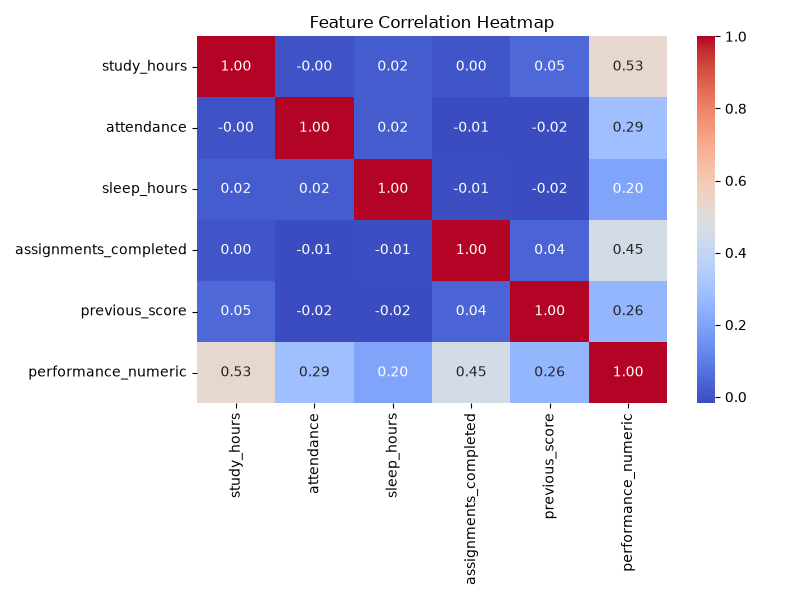
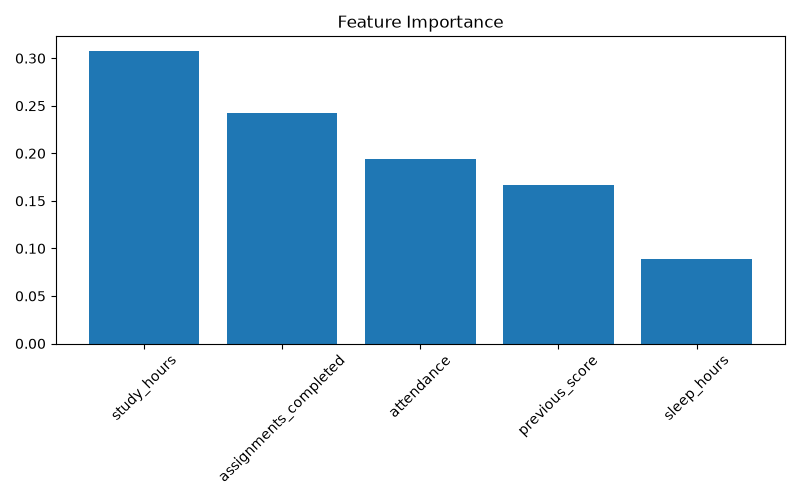
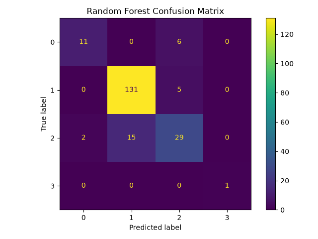
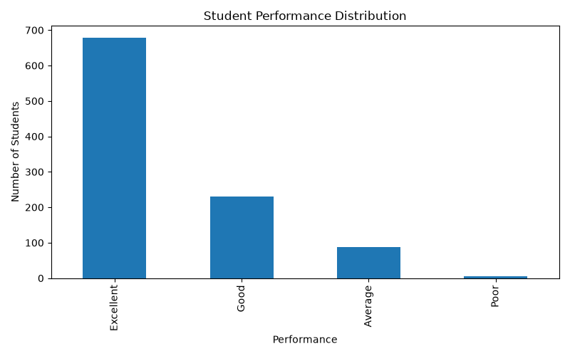

# 📚 Student Performance Predictor

A machine learning application that predicts student academic performance using study habits, attendance, sleep patterns, assignment completion, and previous academic records.

---

## 🚀 Features

* Student Performance Prediction
* Exploratory Data Analysis (EDA)
* Correlation Analysis
* Logistic Regression & Random Forest Models
* Feature Importance Analysis
* Confusion Matrix Visualization
* Interactive Streamlit Web Application

---

## 📸 Application Demo

### Final Prediction Output


### Application Interface


---

## 📊 Model Performance

| Model               | Accuracy |
| ------------------- | -------- |
| Logistic Regression | 96%      |
| Random Forest       | 86%      |

---

## 📈 Visualizations

### Correlation Heatmap



### Feature Importance



### Confusion Matrix



### Performance Distribution



---

## 🛠️ Tech Stack

* Python
* Pandas
* NumPy
* Scikit-Learn
* Matplotlib
* Seaborn
* Streamlit
* Joblib

---

## ⚙️ Installation

```bash
pip install -r requirements.txt
streamlit run app.py
```

---

## 🎯 Key Learning Outcomes

* Data Preprocessing
* Exploratory Data Analysis
* Feature Engineering
* Classification Models
* Model Evaluation
* Data Visualization
* Streamlit Deployment

---

## 📂 Project Structure

```text
Student Performance Predictor/
├── app.py
├── students.csv
├── student_performance_model.pkl
├── requirements.txt
├── generate_dataset.py
├── preprocessing.py
├── train_logistic_regression.py
├── random_forest.py
├── feature_analysis.py
├── predict_student.py
├── correlation_heatmap.png
├── feature_importance.png
├── confusion_matrix.png
└── performance_distribution.png
```

---

## 👨‍💻 Author

**Deblina Mahata**

GitHub: https://github.com/virexan
